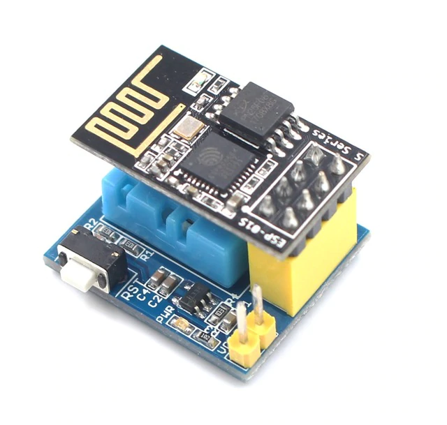
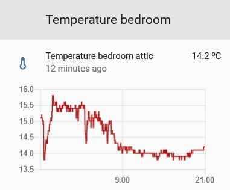
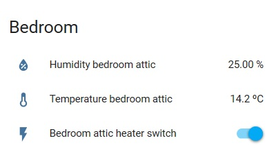
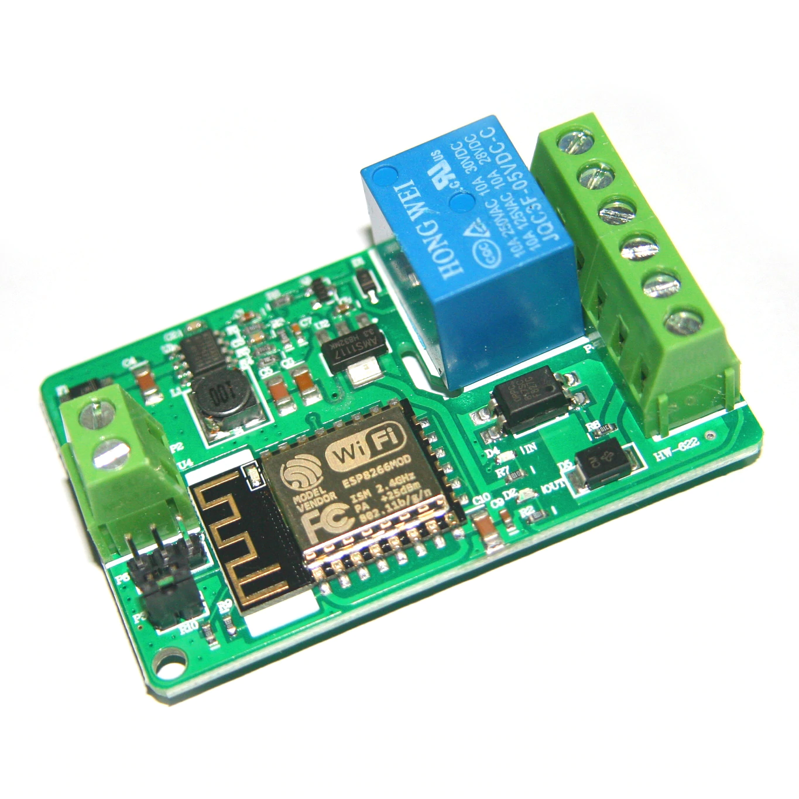

# ESP8266 MQTT library #


The ESP8266 is an amazing chip. It is affordable and most of the times we can find it on a module ready to use and read temperatures, activate relays, etc., which makes it ideal to use for home automation projects (garden automation, garage automation, coffee automation, you name it).

I liked the challenge and decided to acquire a few modules, however also found myself spending time online to research about pins, libraries, trial/error, etc. This costs considerable time when done always for the first time - issue #1. 

What I am interested on each module is the [MQTT](https://www.home-assistant.io/components/mqtt/) communication as it integrates seamlessly with the [Home Assistant](https://www.home-assistant.io/) hub. The modules arrive with multiple kinds of software in them, but I prefer every communication line with  [MQTT](https://www.home-assistant.io/components/mqtt/) to have a clean architecture - issue #2.

Cool, after getting the first temperature sensing module and popping some champagne bottles the time has came to flash five units. Oh wait, I realised, that's a lot of code duplication! - issue #3. After some time found a bug... okay, changing all the five unit's code manually got quite messy. 

**This was the point where I decided to develop this library.**

The principle is simple, the WiFi module connects to the network and to the [MQTT](https://www.home-assistant.io/components/mqtt/) broker, and sends/receives information on the defined topics. Makes this kind of implementations as easy as it can get. 
To give an example, the Arduino code for a DHT11 module (temperature and humidity sensor) will look as follows:
```
#include <Esp8266Mqtt.h>
void setup() 
{
  //instatiates one object of the type Esp8266MQTT
  Esp8266Mqtt node(Esp8266Mqtt::ModuleType::MT_SensTempDht11);

  //Assigns the MQTT topics where the module will send the data to
  node.setTopicTemperature("home/groundFloor/livingRoom/sensor/temperature");
  node.setTopicHumidity("home/groundFloor/livingRoom/sensor/humidity");
  node.setTimeMqttCheckInterval(1000);

  while (true)
  {
    node.loop();
  }

  // Dont forget to adjust the .h file with your wifi and mqtt server data!
}

void loop()
{
}
```

This implementation is great to integrate the WiFi modules with the [Home Assistant](https://www.home-assistant.io/), simply flash a sensor with the right topic names, adjust the configuration files on the Home Assistant server, and *Voilà*, now we can visualise sensor graphs, control light switches, control heating, implement automation rules and so on. Many things need to be prepared but the software for the modules isn't one of them.

I like to think that this library will help people who are not too deep into programming to reach their home automation targets quick and easy. 


## Supported modules ##

**Temperature and humidity sensor**
  - [ESP8266 ESP-01S DHT11 Temperature Humidity Sensor ](http://bit.ly/mqtt_ha_2tW7)

<a href="http://bit.ly/mqtt_ha_2tW7" title="ESP8266 ESP-01S DHT11 Temperature & Humidity Sensor">

</a>

<a href="https://www.home-assistant.io/" title="Bedroom temperature in the last 24h using Home Assistant">

</a>

<a href="https://www.home-assistant.io/" title="Bedroom card on Home Assistant">

</a>


**Relay**
  - [DC 7-30V 1 Channel Relay ESP8266 WIFI Module 220V 10A](http://bit.ly/mqtt_ha_2VOj)


<a href="http://bit.ly/mqtt_ha_2VOj" title="ESP8266 relay module">

</a>


This list will be expanded with time. Let me know which modules you are missing!

## How Does it Work? ##

Copy the library folder to the Arduino libraries location (usually under Documents/Arduino/libraries), restart the Arduino IDE and happy coding!

Feel free to re-use the examples provided.


## Dependencies ##

These are libraries which are used by the ESP8266 MQTT library. Please download them using the Arduino self-built library manager to make sure they are always up to date.

- **Adafruit_Unified_Sensor**
- **DHT_sensor_library**
- **PubSubClient**

## Change log ##

20190310 V0: Initial release

## Contact ##
If you have questions or suggestions about any of these don't hesitate to let me know on esp8266_mqtt@e.email. I will try to reply soon, but please understand if it takes some delay.
